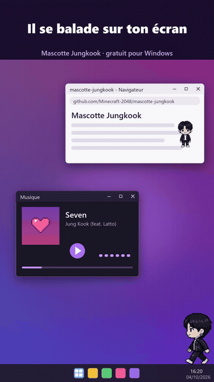
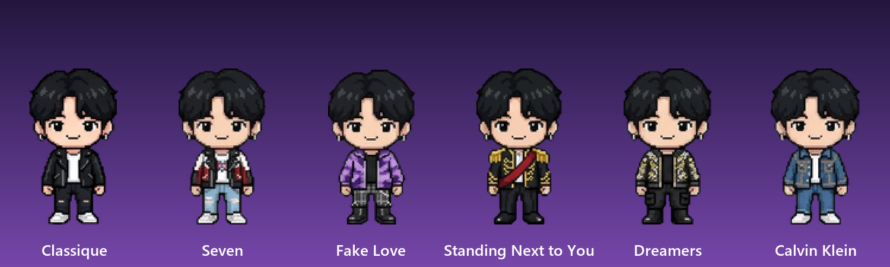

# Mascotte Jungkook



Une petite mascotte de bureau en pixel art pour Windows, façon chibi Jungkook : il se balade sur l'écran, saute sur le haut des fenêtres, envoie des bisous, fait des cœurs avec ses mains, et **danse et chante en rythme quand ton PC joue de la musique**. Six tenues inspirées de ses clips et de ses campagnes.

*A small pixel-art desktop pet for Windows, chibi Jungkook style: he walks along the bottom of the screen, jumps onto your windows, blows kisses, makes finger hearts, and dances on the beat whenever your PC plays music. Six outfits inspired by his music videos and campaigns. Single exe, no install.*

> **Projet de fan, non officiel.** Il n'est ni créé ni approuvé par Jungkook, BTS, BIGHIT MUSIC ou HYBE. Les dessins sont des créations originales en pixel art (générées avec l'aide d'une IA) ; aucune image officielle n'est utilisée.

## Installer

Télécharger `MascotteJungkook.exe` dans les [Releases](../../releases) et le lancer. Windows 10 ou 11, rien d'autre à installer.

L'exe n'est pas signé : Windows peut afficher « Windows a protégé votre ordinateur ». Cliquer sur *Informations complémentaires* puis *Exécuter quand même*.

## Ce qu'il fait

| | |
| --- | --- |
| **Clic** | un bisou, puis un cœur, puis un salut, chacun son tour |
| **Bisou** | il porte la main à ses lèvres, tend le bras, et trois cœurs filent jusqu'à ta souris où ils éclatent |
| **Cœur** | un petit cœur coréen avec les doigts, puis un grand cœur avec les bras au-dessus de la tête |
| **Fenêtres** | pendant ses balades, il saute sur le haut des fenêtres, s'y promène, suit la fenêtre quand tu la déplaces et redescend si elle se ferme (clic droit → *Sauter sur une fenêtre* ou *Redescendre au sol*) |
| **Musique** | dès qu'une musique joue sur le PC, il trouve le tempo et danse dessus ; de temps en temps il prend le micro et des notes s'envolent |
| **Survol** | une petite barre apparaît : ♥ envoie un bisou, ⋯ ouvre le menu |
| **Glisser** | il court dans le sens où on le tire ; lâché en l'air, il retombe sur la fenêtre du dessous ou au sol |
| **Clic droit** | animations, **tenue**, taille, balade, danse avec la musique, premier plan, lancement au démarrage de Windows |

Et le reste du temps il respire, cligne des yeux, se promène, joue à la console ou fait la sieste.

## Les tenues




Clic droit → **Tenue**. Son choix est retenu pour la prochaine fois.

| Tenue | D'après |
| --- | --- |
| Classique | veste en cuir noire, t-shirt blanc |
| Seven | le clip *Seven* (2023) : veste de motard noir, blanc et rouge, jean clair déchiré |
| Fake Love | le clip *Fake Love* (2018) : veste tie-dye violette, pantalon à carreaux |
| Standing Next to You | le clip *Standing Next to You* (2023) : veste militaire à épaulettes dorées, clin d'œil à Michael Jackson |
| Dreamers | la cérémonie d'ouverture de la Coupe du monde 2022 : blouson à strass |
| Calvin Klein | les campagnes denim : tout en jean |

## Comment il entend la musique

Il lit seulement le **niveau** du son qui sort du PC (le même que l'indicateur de volume de Windows). Rien n'est enregistré ni envoyé nulle part. Quand le son est continu et rythmé, il en déduit le tempo (de 60 à 176 battements par minute) et cale sa danse sur les temps. Une ambiance très faible ne le déclenche pas. Pour l'en empêcher : clic droit → décocher *Danser quand il y a de la musique*.

## Le piloter depuis la ligne de commande

```
MascotteJungkook.exe --etat bisou
MascotteJungkook.exe --etat coeur
MascotteJungkook.exe --etat danse
MascotteJungkook.exe --etat chant
MascotteJungkook.exe --etat tenue Seven
```

`--etat tenue` sans nom passe à la tenue suivante. `--etat platform` le fait sauter sur une fenêtre, `--etat down` le fait redescendre. Les autres états de la mascotte (`waving`, `jumping`, `walking`, `sleep`…) marchent aussi.

## Compiler

```
powershell -ExecutionPolicy Bypass -File construire.ps1
```

Le script utilise le compilateur C# livré avec Windows (.NET Framework 4). Python avec Pillow et numpy ne sert qu'à reconstruire les atlas.

- `src/Mascotte.cs` : l'application (WPF, fenêtre transparente toujours visible), avec l'oreille qui écoute le niveau sonore et la gestion des tenues.
- `personnages/jungkook/` : sa fiche (`perso.txt`), ses deux planches de poses sur fond vert (`planche.png` : 12 poses de base, `planche2.png` : bisous, cœurs, danse, chant) et, dans `tenues/`, les mêmes planches pour chaque tenue.
- `outils/construire_atlas.py` : découpe les planches, retire le fond vert, fabrique respiration, saut et marche, et assemble un atlas par tenue (8 colonnes × 14 lignes, cases de 192 × 208) ainsi que les cœurs et notes en pixel art.
- `outils/vitrine.py` : les images de cette page.

Le moteur vient de [Mascotte Claude](https://github.com/Minecraft-2048/mascotte-claude).

## Licence

Code sous licence MIT, voir [LICENSE](LICENSE).
